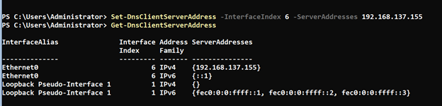

# Active Directory Installation in PowerShell

This project will demonstrate how to setup an Active Directory environment in a home lab using Windows Server 2022 and Windows 11 virtual machines.  After AD is installed, I will show what I have learned about PowerShell scripting and automate the creation of 100 Active Directory users.

---

<br>

# Contents:
- [Setting Up virtual Machines](#setting-up-virtual-machines)
    - [Install a Hypervisor](#install-a-hypervisor)
    - [Download ISO Files](#download-iso-files)
    - [Create Windows Server 2022 VM](#create-windows-server-2022-vm)
    - [Install VMWare Tools](#install-vmware-tools)
    - [Create a Snapshot of Windows Server](#create-a-snapshot-of-windows-server)
    - [Create Windows 11 Workstation VM](#create-windows-11-workstation-vm)
    - [Bypassing TPM](#bypassing-tpm-and-secure-boot-check)
    - [Continue Windows 11 Install](#continue-windows-11-installation)
    - [Install VMWare Tools on Workstation](#install-vmware-tools-1)
    - [Create a Snapshot](#create-a-snapshot)

<br>

- [Install ADDS Service on Windows Server](#install-adds-service-on-windows-server-2022-vm)
    - [What is ADDS?](#what-is-active-directory-domain-services)
    - [Create a Domain Controller](#create-a-domain-controller)
    - [Install ADDS Server Role](#install-adds-server-role)

<br>

- [Configure AD Server as a DC](#configure-active-directory-server-as-a-domain-controller)
    - [What is a forest and a domain?](#what-is-a-forest-and-a-domain)
    - [Configure ADDS](#configure-adds)
    - [Change Hostname, IP, DNS](#change-hostname-ip-dns)
    - [Create a Snapshot](#create-a-snapshot-1)

<br>

- [Create a Client Workstation](#create-a-client-workstation)
    - [Change DNS Server Address & Hostname](#change-dns-server-address--hostname)
    -[Join Client to the Domain](#join-client-to-the-domain)

<br>

- [Automating Domain User Creation](#automating-domain-user-creation)

---
<br><br>

# Setting Up Virtual Machines
## Install a Hypervisor

- This project will be using VMware Workstation 16 Pro (Evaluation version).  

- The reason the Pro version is used over the free Workstation Player version is the ability to take snapshots.  

- You can also use the free version of Virtual Box, which also has the snapshot feature.

- You can download VMware Workstation 16 Pro for your system from this link:

    - https://www.vmware.com/products/workstation-pro/workstation-pro-evaluation.html

<h4 align="center">

**[Back to Contents](#contents)**

</h4>

---
</br>

## Download ISO Files

- Download Windows Server 2022 and Windows 11 iso files.  

- These are large files in the 4 to 5 GB range each.
    - https://www.microsoft.com/software-download/windows11
    - https://www.microsoft.com/en-us/evalcenter/evaluate-windows-server-2022

***Note: Microsoft will want you to register in order to download Server 2022***

<h4 align="center">

**[Back to Contents](#contents)**

</h4>

---
<br>

## Create Windows Server 2022 VM

In this section, we will install a Windows Server 2022 VM and use it as a template to clone other servers as needed.  Using this server, as a template for a clone, will speed up the process of creating a new server by avoiding the full installation procedure of the OS.

- Open VM Workstation Pro

- In the left panel, create a folder to represent your project:  **AD_Project**

- Create another folder in AD_Project and call it:  **ABC_Domain**

- Create another folder in ABC_Domain and call it:  **Base_Templates**

- This is where we will be storing the fresh installs of the VMs to use for cloning

    - 

<br>

- Then go to **File > New Virtual Machine**
- You will be presented with this screen:

    

 
- Leave at **Typical** configuration and click Next.

<br>


    
- Select "I will install the operating system later."  Click **Next**

<br>


- Select **Windows Server 2019**; this is the closest option to Windows Server 2022.  **Next**

<br>


- You can select the location and name of VM as you prefer.
    - VM Name:  **Base-WinServer-2022**

<br>


- You can keep the disk size at the recommended level; I will be setting mine to **100GB**.

- You can choose split the disk or store as a single file.

<br>


- Choose **Customize Hardware**

<br>


- You can customize these settings based on your system. 

    - I adjusted my memory to **4GB** of RAM.

    - In CD/DVD, select use **ISO image file** and locate the ISO for Windows Server 2022 you downloaded.  
    
    - Then **Close > Finish**

<br>


- In the left panel **drag the VM** into the **Base_Templates** folder

- Select **Power on virtual machine**

- **Press a key** to boot from CD

- Select your language

*Note:  when inside a VM, your mouse can get trapped inside the VM.  Just press **Ctrl + Alt** to get the mouse out of the VM.*

<br>


- In this screen we *will not* be using the Desktop Experience.  This is also called Server Core since it does not have a GUI.

- We will be interacting with the server through the command line only:  **Next**

<br>


- Select **Custom: Install**

- Hit **Next** on the next screen.

- Installation will now proceed.

<br>

- After the server restarts it will prompt you to change the Administrator's password.

    - Choose a new password:  **Passw0rd**

    - This is not a secure password, but is easy to remember for this project.

    

<br>


- Choose **option 6 to Install updates**

- On the next screen **option 1 to Install All Updates**

- **Restart** the machine when prompted.

<br>


- After the server installs updates and restarts, we can stop SConfig (the Welcome screen) from launching (see WARNING at top of screen).  By stopping SConfig, it will bring you straight to the command prompt when powering on the machine.

    - Copy the command at the top `Set-SConfig -AutoLaunch $false`

    - Use **option 15** to enter Powershell

    - **Paste** the command > **enter**

    - Then restart with:  `shutdown /r /t 0`

- Verify the SConfig screen no longer displays.

<h4 align="center">

**[Back to Contents](#contents)**

</h4>

---

<br>

## Install VMWare Tools

Installing VMWare tools will allow us to copy and paste commands from outside the VM to the command prompt in the VM and vice-versa.  It will also utilize the full-screen of the VM.

- Go to the left panel, **right-click on Base-WinServer-2022 > Install VMWare Tools**

- At the command prompt list all drives by:  
        `wmic logicaldisk list brief`

    - This will show that Device D has VMware Tools on it.

    

<br>

- Switch to **D:**

- list the contents with **dir**

- run **setup64** > **use tab** to autocomplete

    

<br>
 
- If you don't see a Window pop-up to start the installation, check behind your Terminal window.

- The click **Next** for the next 2 screens and **Install**

    

 <br>

- **Restart** the machine when prompted.

- VM installation complete.  **Poweroff** the VM.

<h4 align="center">

**[Back to Contents](#contents)**

</h4>

---

<br>

## Create a Snapshot of Windows Server

- At the screen below, go to **VM > Snapshot > Take Snapshot**

    

<br>

- Name the snapshot:  **Fresh Install w/VMware Tools**

    

<br>

- Then click on **Edit virtual machine settings**

- Go to **Options > Advanced > Enable Template Mode checkbox > OK**

    

<br>

- Whenever you need to create a new server, you now have a template for a Fresh Install of Windows Server 2022.  

- No need to go through the entire installation process.
    - It's as simple as right-clicking on **Base-WinServer-2022 > Manage > Clone**
    
    - Name your new server and you are done.

<h4 align="center">

**[Back to Contents](#contents)**

</h4>


---

<br>

## Create Windows 11 Workstation VM

- Install the Windows 11 VM the same way we installed Windows Server.

- The guest OS is Windows 10 and later

    

<br>

- I am naming this VM:  **Base-Win11Pro-Workstation**

    


<br>

- Start the VM and press any key to boot from CD.

- Start installation.

- Select your language, but do not proceed further.  Read below.

*Note:  if you continue with the installation, Windows will give you an error that it does not meet system requirements.  The issue is that Windows makes a TPM check, Secure Boot check, and RAM check to ensure the machine meet its requirements.  For this project we can work around this error.*


<h4 align="center">

**[Back to Contents](#contents)**

</h4>


---

<br>

## Bypassing TPM and Secure Boot Check

<br>

> A TPM, or Trusted Platform Module, improves the security of your PC by securely creating and storing cryptographic keys.   *-Microsoft*

> Secure Boot is an important security feature designed to prevent malicious software from loading when your PC starts up (boots).	*-Microsoft*

- For this project we can bypass these requirements by adding registry values *(tomshardware.com)*

- At the language screen or any screen before the error message, hit **Shift+F10**

    - This will give you a command prompt.
    - Type in:

    ```
    reg add HKLM\SYSTEM\Setup\LabConfig /v BypassTPMCheck /t REG_DWORD /d 1
    
    reg add HKLM\SYSTEM\Setup\LabConfig /v BypassSecureBoot /t REG_DWORD /d 1
    ```

    

    - You should get 'operation completed successfully' if everything was typed in correctly.

<br>

- Close terminal when complete and continue with installation.

<h4 align="center">

**[Back to Contents](#contents)**

</h4>


---

<br>

## Continue Windows 11 Installation

- Select **'I don't have a product key'**

    

<br>

- On the next screen select **Windows 11 Pro for Workstations**

    

<br>

- If you get up to the licensing agreement, the bypass checks succeeded!  **Accept**

- Continue with installation.

<br>

- Choose **Custom: Install**

- Then **Next** on the following screen

    

<br>

- After you choose your country, keyboard layout, and the updates check, it will ask you to name the device.

    - I chose **skip for now**

    

<br>

- Choose **set up for work or school**

    

<br>

- We won't sign in with an online account, so choose **sign in options**

    

<br>

- By choosing **Domain join instead**, this will create a local account on the machine.

    

<br>

- The username will be **local_admin**, with password: **P@ssword123**

    

<br>

- For the 3 security questions on the next screens, I selected any question and typed **na** for the answer.

<br>

- Uncheck all privacy options and Accept:

    

<br>

- Let this finish updating and restarting.

<h4 align="center">

**[Back to Contents](#contents)**

</h4>


---

<br>

## Install VMWare Tools

- After the restart is complete, go to the left panel, right-click on **Base-Win11Pro-Workstation > Install VMWare Tools**

- If the desktop does not show the autorun option, just click on **File Explorer > D: drive > setup64**

    

<br>

- **Next** your way through and **Install**

- When it's finish you should notice a full screen for your desktop. 

- Finish restart.

<br>

- Sign in again and pull up a **command prompt**

- Type `net users` to view users on the machine and verify your account.

    

<br>

- Shutdown machine with:  `shutdown /s /t 0`

<h4 align="center">

**[Back to Contents](#contents)**

</h4>


---

<br>

## Create a Snapshot

- Take the snapshot the same way we did the server.

- This one will be called **Fresh Install w/VMWare Tools**

    

<br>

- Then, click on **Edit virtual machine settings**

- Go to **Options > Advanced > Enable Template Mode checkbox > OK**

    

<br>

- Finally, **drag** the base vm into the **Base_Templates folder**.

    

<h4 align="center">

**[Back to Contents](#contents)**

</h4>


---

<br>

# Install ADDS service on Windows Server 2022 VM

In this next section, we will install Active Directory Domain Service on a new server that we will clone from our Base-WinServer.

<br>

## What is Active Directory Domain Services?

> Active Directory Domain Services (AD DS) is the foundation stone of every Windows domain network. It stores information about members of the domain, including devices and users, verifies their credentials and defines their access rights.  

> The server running this service is called a domain controller. A domain controller is contacted when a user logs into a device, or accesses another device across the network.  It authenticates and authorizes all users and computers in a Windows domain type network, assigning and enforcing security policies for all computers, and installing or updating software. 

> - For example, when a user logs into a computer that is part of a Windows domain, Active Directory checks the submitted username and password and determines whether the user is a system administrator or normal user.

> Also, it allows management and storage of information, provides authentication and authorization mechanisms and establishes a framework to deploy other related services: 

> - Certificate Services, 
> - Active Directory Federation Services, 
> - Lightweight Directory Services, and 
> - Rights Management Services  

> Other Active Directory services, as well as most of Microsoft server technologies, rely on or use Domain Services; examples include Group Policy, Encrypting File System, BitLocker, Domain Name Services, Remote Desktop Services, Exchange Server and SharePoint Server.

> The self-managed Active Directory DS must not be confused with managed Azure AD DS, which is a cloud product.  *-Wikipedia*

<h4 align="center">

**[Back to Contents](#contents)**

</h4>


--- 

<br>

## Create a Domain Controller

- Create a folder called **Servers** and **drag** it into ABC_Domain folder

- Make a new Domain Controller Server

    - **Clone Base-WinServer-2022** machine and call it **DC-01**
     
    - **Drag** into Server folder

    

---

<br>

## Install ADDS Server Role

- Power up DC-01

- If you type in this command, it will show you Windows features that have been installed or are available to install:<br>
    
    `Get-Windowsfeature | ? { $_.Name -LIKE "AD*" }`

    - We will be installing Active Directory Domain Services

    - This cmdlet also shows the **Name** column that we will use in the next command.

    

<br>

- To install Active Directory Domain Service, type:  

    `Install-WindowsFeature -name AD-Domain-Services -IncludeManagementTools`

    

<br>

- When it is finished, your Success column should read 'True'

    

<h4 align="center">

**[Back to Contents](#contents)**

</h4>


---

<br>

# Configure Active Directory Server as a Domain Controller

In this example, we will add Windows Server 2022 as a domain controller in a new forest and domain. 

<br>

## What is a forest and a domain?

> A domain is defined as a logical group of network objects (computers, users, devices) that share the same Active Directory database.

> A tree is a collection of one or more domains.

> At the top of the structure is the forest. A forest is a collection of trees that share a common global catalog, directory schema, logical structure, and directory configuration. The forest represents the security boundary within which users, computers, groups, and other objects are accessible. 

> The Active Directory framework that holds the objects can be viewed at a number of levels. The forest, tree, and domain are the logical divisions in an Active Directory network.

> Within a deployment, objects are grouped into domains. The objects for a single domain are stored in a single database (which can be replicated). Domains are identified by their DNS name structure, the namespace.  *-Wikipedia*

<h4 align="center">

**[Back to Contents](#contents)**

</h4>


---

<br>

## Configure ADDS

- I’m going to use a top-level domain (TLD) called **abc.com** in this example. 

- In this lab environment you don't need to worry about owning the domain, but in a real environment you should make sure that you own the public TLD. 

- To configure Windows Server 2022 as a domain controller, run `Install-ADDSForest` as shown in the example below. 

- You should note that `Install-ADDSForest` is only used when you are installing the first domain controller in a new AD forest.

    - When you run the `Install-ADDSForest` cmdlet, you’ll be prompted to enter a password for Safe Mode.  Enter a password and confirm it when prompted.

    - After the password is entered, type **A** to configure all and restart.

    

<br>

- Once it restarts, you will see your credentials are now prepended with a domain name.

    

<h4 align="center">

**[Back to Contents](#contents)**

</h4>


---

<br>

## Change Hostname, IP, DNS

All of the changes we make below can be done using `sconfig`, but we will make these changes using the PowerShell command line instead.

- Change computer name:

    - To output the computer name type:  `hostname`
    
    - This will show the default name the computer chose when this machine was created.

    - Type this command to change the name to DC-01:

        `Rename-Computer -NewName DC-01`

    - Then use `hostname` again to verify

    

<br>

- DC-01 will need to have a static IP address:

    - Check first with `Get-NetIPConfiguration -Detailed`

    - Note your **InterfaceIndex**

    - DHCP is currently enabled

    - To change the IP address we'll need to use:

        `New-NetIPAddress -InterfaceIndex 6 -IPAddress 192.168.137.155 -PrefixLength 24 -AddressFamily IPv4 -DefaultGateway 192.168.137.2`

    

<br>

- Change the DNS server in PowerShell:

    `Get-DnsClientServerAddress`

    - This will show that the AD installation set the DNS server address as your loopback address.

    

    <br>

    - Set DNS Preferred Server to your static IP address:
    
        `Set-DnsClientServerAddress -InterfaceIndex 6 -ServerAddresses 192.168.137.155`

        `Get-DnsClientServerAddress`

    

<h4 align="center">

**[Back to Contents](#contents)**

</h4>


---
<br>

## Create a Snapshot

- As we did before, power down the machine

- In the left panel, **right click on DC-01 > Snapshot > Take Snapshot**

- Call it **Initial ABC Domain Setup**

    

---

<br>

# Create a Client Workstation

- Create a folder called **Workstations** and drag it into ABC_Domain folder

- Make a new Client Workstation:

    - Clone **Base-Win11Pro-Workstation** machine and call it **WS-01**

    - **Drag** into Server folder

    

<h4 align="center">

**[Back to Contents](#contents)**

</h4>


---

<br>

## Change DNS Server Address & Hostname

- Power on WS-01 and login.

- We will first change the DNS server address in client so it can find DC-01:

    - Open PowerShell as an Administrator

    - Have a look at the current configurations with:

        `Get-NetIPConfiguration -Detailed`

        `Get-DnsClientServerAddress`

    - Change the DNS Server Address as we did previously to DC-01 server address:

    

<br>

- Change the hostname to WS-01 as we did previously for the domain controller.

    `Rename-Computer -NewName WS-01`

<h4 align="center">

**[Back to Contents](#contents)**

</h4>


---

<br>

## Join Client to the Domain

- Make sure DC-01 is powered on.  WS-01 will need to communicate with the domain controller.

- On WS-01, open an Administrative Terminal:

    `Add-Computer -DomainName abc.com -Restart`
    
    - A box will pop up to enter your credentials.  These will be the credentials for DC-01:

        **Administrator <br> Passw0rd**

- Once this restarts, you will have a new login option 'Other User'

    - This will log a user into the domain, but we first need to add users to the domain before this option can be used.

<br>

- Power this machine off and take another **Snapshot**

    - Call the Snapshot:  **Joined to Domain**

<br>

- Power off DC-01 and take another **Snapshot** called:  **WS-01 Joined to Domain**

<h4 align="center">

**[Back to Contents](#contents)**

</h4>


---

<br>

# Automating Domain User Creation

Now that we have the Domain Controller setup and a workstation setup.  Let's run through a probable scenario:

*At work, you sent your manager an email that your task of setting up DC-01 and WS-01 VMs is complete.  Your manager responds by email, giving you a task to add 100 employees to the domain.  In this email, there is an attachment ([employees.txt](employees.txt)) with the names for 100 users that you will need.* 

*Your job is to add the 100 users by the end of the day and there is not much time left.  This will need to be automated through PowerShell.*

*You will not be able to physically access DC-01 and you will need access this server through your workstation (WS-01) from the local_admin account.*

<br>

1.	We will need to setup a remote connection to DC-01 from PowerShell using the `New-PSSession` cmdlet.  There are a few steps to make this procedure successful:

    - Make sure DC-01 is powered on.
    
    - Power on WS-01
    
    - In WS-01 open Terminal as Administrator.
    
    - Check if WinRM service is running with:
    
        `Get-Service -Name WinRM`

        
    
    <br>

    - Start WinRM with:  `Start-Service -Name WinRM`

        

    <br>

    - Create a session with:

        `$dc_connect = New-PSSession DC-01 -Credential (Get-Credential)`

    - Sign in with DC-01 credentials

        

    <br>

    - Verify your new session with:  `Get-PSSession`

        

<br><br>

2.	Add a new Organizational Unit (Users-Test)

    - An Organizational Unit (OU) is necessary for organizing a domain's hierarchy.  
    
        -  For example, normal users can be in OU-Users, Managers in OU-Managers, etc.
    
            

    <br>

    - The OU will need to be created on the domain controller DC-01.  
    
    - The PowerShell commands will be remotely applied from WS-01 workstation.

    - Since we already created a New-PSSession, we can now enter it with:
    
        `Enter-PSSession $dc_connect`

        

    <br>

    - Next, we'll want to verify what OUs are on the machine:

        `Get-ADOrganizationalUnit -Filter * | Format-Table Name, DistinguishedName`
    
    - This should show Domain Controllers as the only OU created.

        

    <br>

    - Let's add an new OU called "Users-Test":
    
        `New-ADOrganizationalUnit -Name "Users-Test"`

        
    
    - Shutdown both machines DC-01 and WS-01 and create new **Snapshots**
        - For each machine call the snapshots:
            - **WS-01 Joined; Added OU Users-Test**
        
        
    
    <br>

    - When you are finished, start both machines back up.

<br>

3.	Copy employees.txt to DC-01 C:\Users\Administrator\Documents\employees.txt

    - If you are continuing from the previous step you will need to start a new PSSession as we did previously:

        `$dc_connect = New-PSSession DC-01 -Credential (Get-Credential)`

    - If you are not continuing from the previous step, you'll need to exit the current PSSession with: `exit`

    - Create a folder on your Desktop:  **Create_Users**

        `mkdir C:\Users\local_admin\Desktop\Create_Users`

        

    - Save [employees.txt](employees.txt) to the new folder
    
    - Then:  
        
        `Copy-Item \Desktop\Create_Users\employees.txt -ToSession $dc_connect C:\Users\Administratators\Documents\employees.txt`

    - If no error message appears, the copy is successful

<br>

4.	Create a PS script that can add users from the employee.txt file to the Users_Test OU in the domain

    - In the Terminal, type: `powershell_ise.exe`
    
    - You can create your script here or paste the one I have below.
        
        - [Create-Users.ps1](Create-Users.ps1)
            
    - Save this file as in the Create_Users folder:
     **\Desktop\Create_Users\Create-Users.ps1**

        

<br>

5.	Let's create the users by running the script on WS-01:

    - First you will need to configure the Execution Policy to run PowerShell scripts with:

        `Set-ExecutionPolicy Unrestricted`

    - Then:

        `Invoke-Command -Session $dc_connect -FilePath .\Desktop\Create_Users\Create-Users.ps1`
    
    - You should see users being created on DC-01:

        

<br>

6.  You can pick any user to login with the 'Other User' option on your workstation with the password **Pass1234**

    

<br>

Success!

Now that we have our Active Directory setup with 101 normal users, we can build on this to harden the system and try to find vulnerabilities.

More projects coming soon!

<h4 align="center">

**[Back to Contents](#contents)**

</h4>

