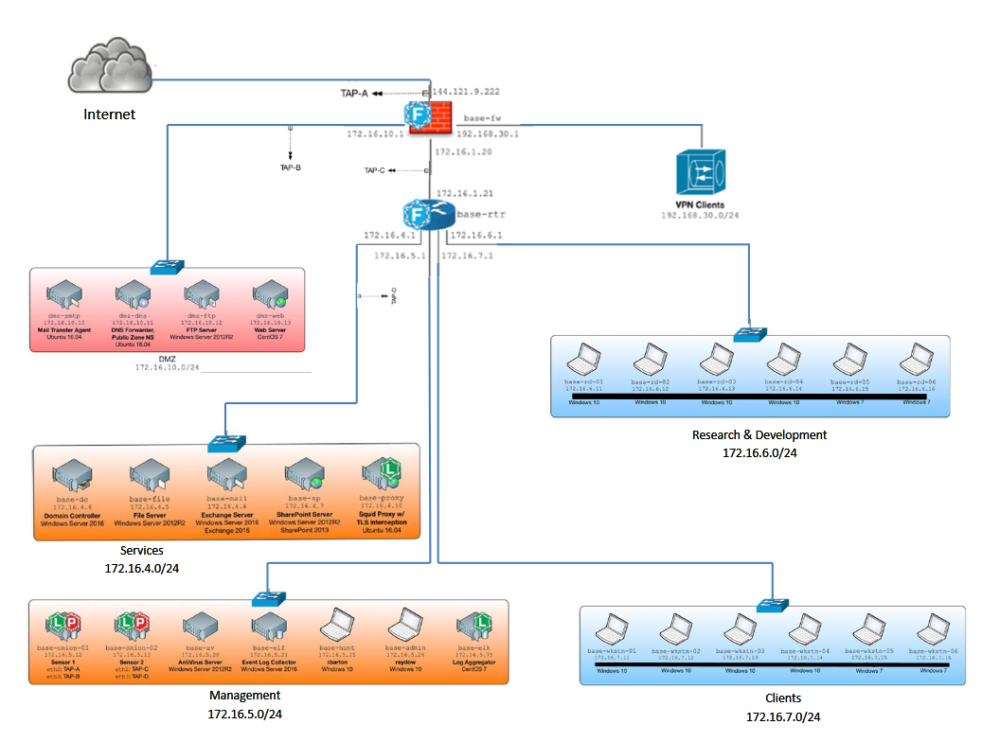

# APT Intrusion Scenario

The analysis performed in this class project aims to fulfill the analytical requirement for successful completion of the Forensics 508 course offered by SANS and to attain the Global Information Assurance Certification (GIAC) Certified Forensics Analyst (GCFA) certification.

This project will showcase:
- advanced incident response (IR), 
- threat hunting (TH), 
- intrusion analysis, 
- memory forensics in IR and TH
- timeline analysis
- advanced adversary and anti-forensics detection
---
## Scenario
An advanced persistent threat (APT) was detected on the network of a medium-sized enterprise after unusual behavior was observed on the corporate network. 
- Specifically, the mail server experienced multiple instances of unresponsiveness and the web server went offline during a critical business period. 
- The IT staff, suspecting malicious activity as the root cause, initiated triage steps against the corporate Exchange mail server by collecting memory and file system images using the Kansa Incident Response Framework and F-Response. 
- As the investigation progressed, additional triage images and full disk images were collected over the course of several days. 
- Initial analysis suggests that multiple hosts were likely compromised. 
- Due to a lack of sufficient staffing and expertise, the company decided to hire an outside consulting firm to complete the response and scope the intrusion fully.
---
## Internal Network Map

---
## DMZ Network

- The DMZ network consists of a web server, FTP server, SMTP server, and DNS server. 
- The gateway firewall provides inbound client-VPN access. 
- Employees often use VPN while working remotely.

 ---
## Domain Configuration
The network was setup according to US government guidelines, with many security controls implemented:

- The domain is on Windows Server 2016.
- Full auditing is turned on per recommended guidelines.
- Event log forwarding enabled as well, sending logs to the "base-elf" server.
- Win-RM fully enabled to support PowerShell Remoting and Windows event log forwarding.
- All systems upgraded to PowerShell v5.
- Fully patched systems at the time of collection.  Patches are automatically installed.
- Enterprise Incident Response agents installed (F-Response Enterprise).
- Enterprise A/V and HIPS-capability (McAfee® Complete Endpoint Threat Protection---including AV, HIPS, and Onsite Management & Reporting via ePolicy Orchestrator server).
- Users are restricted to being users. They do not have administrative rights on their systems.
- Exchange 2016 on Server 2016, supporting ActiveSync for mobile devices and "Outlook on the Web" (OWA) for web browser access.
- Systems installed with common software on it that is used regularly (Office, Outlook, Adobe, Firefox, and Chrome).
- Firewall blocks direct inbound & outbound traffic for internal networks. 
- Systems must connect through a proxy for web access.
- Unique strong passwords assigned to all local admin accounts.

---
