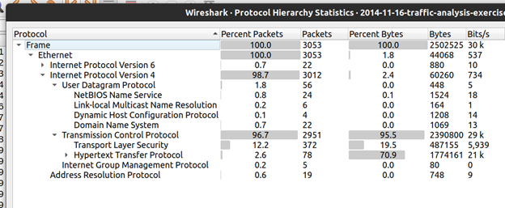

# 2023-11-16 pcap Analysis

- This analysis was performed in Ubuntu VM since the malware is Windows based.
- The exercise and pcap file is located at:
  - https://www.malware-traffic-analysis.net/2014/11/16/index.html
---
## Questions to Answer
1. [What is the IP address of the Windows VM that gets infected?](#1-what-is-the-ip-address-of-the-windows-vm-that-gets-infected)

2. [What is the host name of the Windows VM that gets infected?](#2-what-is-the-host-name-of-the-windows-vm-that-gets-infected)
3. [What is the MAC address of the infected VM?](#3-what-is-the-mac-address-of-the-infected-vm)
4. [What is the IP address and domain name that delivered the exploit kit and malware?](#4-what-is-the-ip-address-and-domain-name-that-delivered-the-exploit-kit-and-malware)
5. [What is the redirect URL that points to the exploit kit (EK) landing page?](#5-what-is-the-redirect-url-that-points-to-the-exploit-kit-ek-landing-page)
6. [What is the IP address and domain name of the compromised web site?](#6-what-is-the-ip-address-and-domain-name-of-the-compromised-web-site)
7. [Besides the landing page which contains the CVE-2013-2551 IE exploit, what other exploit/s sent by the EK?](#7-besides-the-landing-page-which-contains-the-cve-2013-2551-ie-exploit-what-other-exploits-sent-by-the-ek)
8. [How many times was the payload delivered?](#8-how-many-times-was-the-payload-delivered)
9. [Submit the pcap to VirusTotal and find out what snort alerts triggered.  What are the EK names are shown in the Suricata alerts?](#9-submit-the-pcap-to-virustotal-and-find-out-what-snort-alerts-triggered-what-are-the-ek-names-are-shown-in-the-suricata-alerts)
10. [Check on the pcap author’s website https://www.malware-traffic-analysis.net, what has he and others been calling this exploit kit?](#10-check-on-the-pcap-authors-website-httpswwwmalware-traffic-analysisnet-what-has-he-and-virustotal-been-calling-this-exploit-kit)
11. [What file or page from the compromised website has the malicious script with the URL for the redirect?](#11-what-file-or-page-from-the-compromised-website-has-the-malicious-script-with-the-url-for-the-redirect)
12. [Extract the exploit file/s.  What is/are the md5 file hash/es?](#12-extract-the-exploit-files-what-isare-the-md5-file-hashes)
---

### 1. What is the IP address of the Windows VM that gets infected?  
- **172.16.165.165**

- From this question, we see that it is a Windows machine, but if your pcap had hundreds of IP addresses, how could we narrow down the IP address types to look for.

- This would most likely be a user’s machine, which would indicate a private IP address type as indicated by RFC 1918:
  - 10.0.0.0/8
  - 172.16.0.0/12
  - 192.168.0.0/16

- You can view Statistics > Endpoints to get an overview if any of these private IP addresses exist in this pcap

- Below shows 16 IPv4 addresses in this pcap sending and receiving data, sorted by total bytes of data sent/received.  

- Since the private IP address of 172.16.165.165 is  the top-talker, we can assume this is the infected device.

- There are other private IPs:
  - 172.16.165.2 seems to be the default gateway
  - 172.16.165.255 is used as a broadcast address
 
- Another way to check the infected device is to view the Protocol Hierarchy used in this pcap

- Below, the image shows the IPv4 protocols in use:
  - UDP – DNS, NBNS, DHCP, LLMNR
  - TCP – HTTP, TLS

- It’s most common for malware to come in over TCP, http protocol

 
- You can start with a simple display filter to narrow this down:  `http.request`

- This shows all http requests were made by one device:  **172.16.165.165**

- We can safely assume this is the infected device

 

---

 

### 2. What is the host name of the Windows VM that gets infected?  

- **K34EN6W3N-PC**

- A DHCP Request packet will contain the client host name that it needs to provide to the DHCP server to obtain or renew its IP address, we can use DHCP as a display filter:

  -  `dhcp && ip.src == 172.16.165.165`

 

- This can also be confirmed in NBNS with the filter:  `nbns`
 
 

- If it is a Windows 10 computer using Active Directory (not using DHCP or NBNS), try using the display filters:  
  - `udp && ip contains DESKTOP-`  
  or
  - `kerberos.CNameString`   
 

---

 

### 3. What is the MAC address of the infected VM? 
**f0:19:af:02:9b:f1**

- The MAC address is listed in the DHCP, NBNS, or any other packet with this IP

- The MAC address (Media Access Control address) is a layer 2 address in the OSI (Open Systems Interconnection) model. 
- It is used to uniquely identify network devices at the Data Link layer. 
- The MAC address is assigned to the network interface card (NIC) of a device by the manufacturer, and it is used by the Data Link layer protocols, such as Ethernet, to transmit data between devices on a local network. 
- Let's have a look at Ethernet in the Packet Details:
 
 

- The first 3 octets are the OUI, Organizationally Unique Identifier, which f0:19:af indicates a Dell device

- MAC addresses can be spoofed, so how can we confirm this is legitimate?
  - Confirm with User-Agent heading in a GET request packet….what?  why?
  - A User-Agent heading will give device, OS, and web browser information
  - Confirming with a User-Agent heading (below), shows this device is a 32 bit, Windows 7, using MSIE 8.0 browser
  - To find this, use http as a display filter > right click on a GET request > Follow > HTTP stream:
 

- MSIE 8.0 browser is Microsoft Internet Explorer Version 8.0
- Windows NT 6.1 is a Windows 7 computer
- WOW64 is 32 bit processor
- We can safely assume the MAC address has not been spoofed since Dell computers do run Windows 7 OS and can use MSIE as a browser

 

---

 

### 4. What is the IP address and domain name that delivered the exploit kit and malware?
- **37.200.69.143**
- **stand.trustandprobaterealty.com**

- How do we approach this?  What should we look for?  What do we know for sure (high-level)?

  - There are several ways to approach this
  - We can start with what we know so far.  We know the IP address and the protocol being used (http)
  - We can use `http.request` to look for any suspicious looking GET requests
  - If we compare how normal GET requests look, usually readable and you can assume what is being requested, such as a file, image, html page, java script page, then taking a closer look at the requests going to *stand.trustandprobaterealty.com* look highly suspicious since these are encoded.
 
  
 
  

- An easier way to view this is in Statistics > HTTP > Requests:

 

 

Since these requests look suspicious, we can see what was downloaded from this host by going to `File > Export Objects > HTTP`.  
  - Type in ‘stand’ to view the files from this host.

- This shows 11 files downloaded from this host, but which ones are potential malware?

**WARNING:  Be careful when downloading these files; do not open these on a Windows machine as these are live malware**

- We can download each one of these files and submit to virustotal.com
- Since these files had such long names and there were duplicates:
  - I renamed the files to shorter names
  - Compared the hashes and removed the duplicates
  - I created a bash script (submit_hash.sh ) to submit files to virustotal.com
    - To do this you need to sign up for a free account and use your own API-key

- This script can submit a directory of files quickly and find the malicious ones.  You can further check the malicious ones on the VT website to get more detail.

- To summarize this step:
  - we found suspicious GET requests from a host, 
  - verified files were downloaded from this host, 
  - submitted the file hashes to virustotal to confirm maliciousness
  - It’s not enough to have suspicious requests; evidence is irrefutable

 

---

 

### 5. What is the redirect URL that points to the exploit kit (EK) landing page?
**24corp-shop.com**

- One way to see how requests are connected to one another is from a convenient feature Wireshark offers by going to Statistics > HTTP > Request Sequences

- The above image shows a hierarchy of requests leading from one domain to the next

- It is easy to see that *ciniholland.nl* can be the compromised site and that *24corp-shop.com* is the redirect URL to the EK landing page, *stand.trustandprobaterealty.com*

- We should reconcile the above with evidence

- Use display filter `http.host` to make it easy to find *24corp-shop.com*

- Here you can see that after the device visited this host it went directly to the EK page at *stand.trustand probaterealty.com*

- Also, viewing the TCP Stream ID column, shows the stream incrementing from 19 to 20, which indicates the very next tcp connection from *24corp-shop.com* was to the EK page.

- Following the HTTP stream from the above packet and scrolling down a bit, you will find an iframe that points to the malicious website, as shown below:

- In summary, we corroborated several pieces of evidence:
  - The Request Sequences hierarchy overview
  - The `http.host` filter showing the host sequence
  - The tcp stream id 
  - And the most important piece, the html code from the redirect http page

 

---

 

### 6. What is the IP address and domain name of the compromised web site?   
- **82.150.140.30**
- **ciniholland.nl**

- As from above, we see that from the HTTP Request Sequences that *ciniholland.nl* is at the top of the hierarchy, just after *Bing*

- Using display filter `http.host`, follow the HTTP stream of the main GET request page: 

- Scroll down a little bit, or type in the search ‘24corp’ to find the compromising evidence

- The website *24corp-shop.com* is embedded on the landing page of *ciniholland.nl*

- The user on device 172.16.165.165 must have clicked this malicious URL on the ciniholland site and did not realize that it downloaded malicious content in the background.

-	After clicking on this compromised website, it downloads a GIF file, **notfound.gif**

  - this gif was suspicious and caught my attention
  - it is a GIF according to 'file' command
  - it is not malicious according to virustotal, but maybe it is encrypted
  - We might need some Steganography on this GIF file (side project)

 

---

 

### 7. Besides the landing page which contains the CVE-2013-2551 IE exploit, what other exploit/s sent by the EK?

- After running virustotal on the files from *stand.trustandprobaterealty.com*, the html page, the .swf, and the .jar files came back as malicious

- Below is the shockwave flash (swf) file.  Notice the tags below the file, “flash, exploit, cve”, confirming this is an exploit

- Below is the java archive (jar) file.  Notice the tags below the file, “exploit, cve”, confirming this is also an exploit

 

---

 
    
### 8. How many times was the payload delivered?

- How do we find the payload?  What is a payload?

> A payload refers to the malicious code or instructions that are delivered to a target system as part of a cyberattack. It is the part of the attack that actually causes harm or damage to the targeted system, network, or application.  Payloads can come in many different forms, including viruses, trojans, worms, ransomware, spyware, and adware. The payload may be designed to exploit a vulnerability in the target system or application, steal sensitive data, or perform some other malicious activity.

> Payloads are often delivered via various attack vectors, such as email attachments, malicious links, drive-by downloads, and social engineering tactics. Once the payload is executed on the target system, it can perform various actions, such as deleting files, stealing data, or installing backdoors for future access.

- Now we know what a payload is, how can we find it?  

- Let’s start with what we know about a payload.  

- It can be disguised (Trojan); can we trust virustotal 100% to notify us of a payload?

- A file that is disguised, can have a different file extension and/or be encrypted in order to trick the user to open it, and/or bypass A/V

- We can see in the Export Objects window above that a large file (401kB) was delivered 3 times; however, this file is non-malicious according to virustotal.  

- We should look at this further.
c.	Looking at the Export Objects window again have a look at the 401kB file.  Notice anything unusual?

- In the Filename column it shows a keyword that might be used as the extension (mp3), but the Content type is “application/x-msdownload”.   What is this?

> The file type "application/x-msdownload" typically refers to an executable file that is designed to run on Microsoft Windows operating system. This file format is often used to distribute software programs and updates through the internet.

> When you download a file with the "application/x-msdownload" MIME type, your browser typically recognizes it as an executable file and prompts you to save or run the file. Examples of files with this MIME type include .exe (executable files), .msi (Windows Installer files), and .dll (dynamic link library files).

> It's worth noting that the MIME type "application/x-msdownload" has been deprecated, and it has been replaced by newer MIME types such as "application/octet-stream" and "application/vnd.microsoft.portable-executable". However, many older programs and websites may still use the "application/x-msdownload" MIME type.

> It is possible to rename a file with the extension ".mp3" to make it appear as if it is an audio file, even if the actual content of the file is an executable file with the MIME type "application/x-msdownload". However, this does not actually change the file type or content of the file itself, and attempting to execute a file with a ".mp3" extension could still result in the execution of the underlying executable code.

- Let’s see if we can verify if this is an mp3 with the file command (I renamed the long filename to **file1.mp3**).  Below it shows the file as ‘data’.  That’s suspicious since this should show as an Audio File, not data.
 

- Let’s find the packet in Wireshark and Follow the stream to find any other clues about this file.
 

- Below shows the HTTP stream.  Notice the Referrer is absent in the GET request (red fonts)

- There is also indication of session hijacking for “PHPSSESID” in the request

- The Content-Type from the server reply indicates “application/x-msdownload” not an mp3 or audio type file
 

- Let’s look at a higher level view of what happened when landing on the *stand.trustandprobaterealty.com* home page

- We see below there were 2 tcp streams (20, 21) that were opened on ports 49451 & 49452
 

- Let’s follow filter these streams with 
  - `http.host && tcp.stream == 20`

- This stream shows that after landing on the malicious home page, there is a request for the payload (mp3), followed by a request for the exploit (swf).

- If you pull up tcp stream 21, this shows the same thing, which is why there were duplicates of these files in Export Objects

- What about the jar file exploit?  Why is this not showing in this stream?

- A high-level view shows that after the GET Request for the swf file, another GET request was issued for an xml document.  See below.

- Let’s filter Stream ID 28 and 29.  

- We see below that after the xml, a GET request for the jar file exploit was issued.  We can assume the xml file is also a Trojan as this was not considered malicious in virustotal.
 

- Let’s Follow the HTTP stream to view the xml data.  Interesting?  Notice again no Referrer in the header and a reference in the body to the jar exploit download
 

- If you scroll down to the bottom, (this would be the end of the jar file) you will see another red flag.  

  - Obfuscation was used to conceal this java archive file.  See below image.

 

- In summary, there were 2 payloads found that delivered 2 different exploits:
  - Payload 1:  application/x-msdownload file (an executable)
  - Payload 2:  a malicious XML file

 

---

 

### 9. Submit the pcap to VirusTotal and find out what snort alerts triggered.  What are the EK names are shown in the Suricata alerts?

- Below the pcap is flagged as malicious with several CVEs associated
 

 

- Below are the Snort alerts that were triggered.  Notice the exploit kits.

 

- Below are the Suricata alerts.  Notice the EK names.

 

---

 

### 10. Check on the pcap author’s website https://www.malware-traffic-analysis.net, what has he and Virustotal been calling this exploit kit?

- Rig Exploit Kit

 

---

 

### 11. What file or page from the compromised website has the malicious script with the URL for the redirect?

- The index page from *ciniholland.nl* had the malicious script with the redirect URL *24corp-shop.com*

- This was answered in question 6 above

 

---

 

### 12. Extract the exploit file/s.  What is/are the md5 file hash/es?

    

> ### If you made it to the end, please let me know.  Feel free to send me a message on LinkedIn and connect.  

- *Thank you for taking the time to view this tutorial.*  
